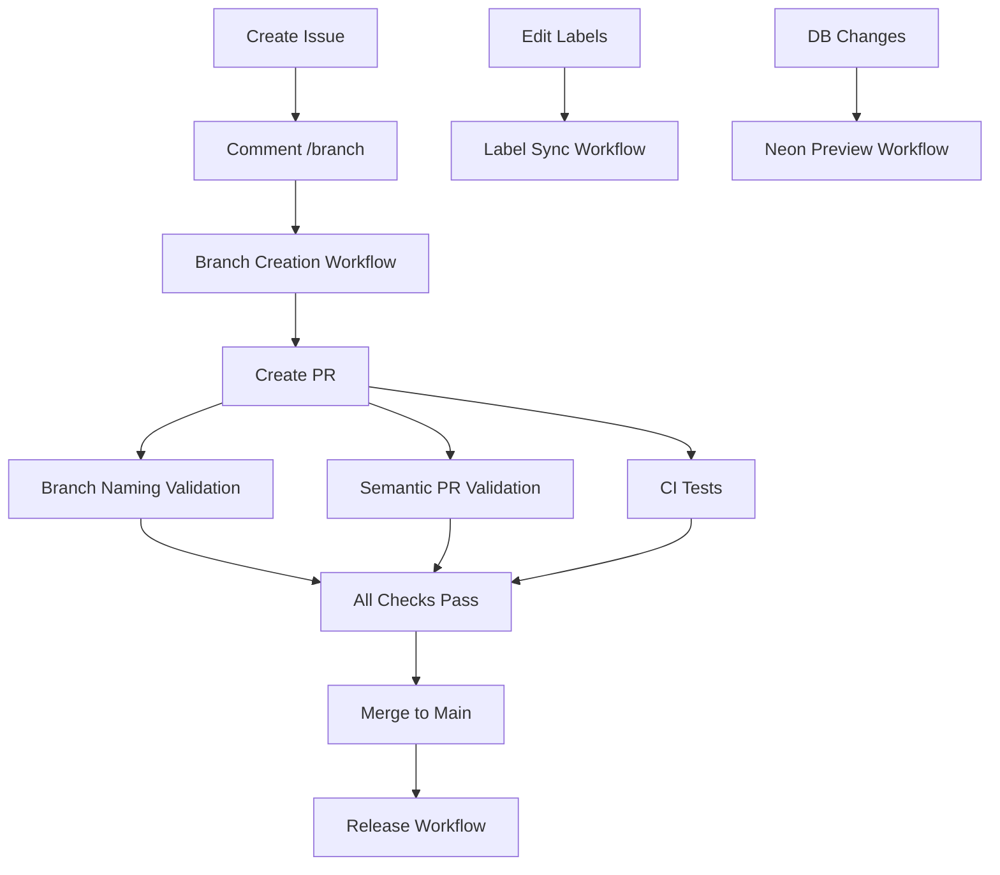
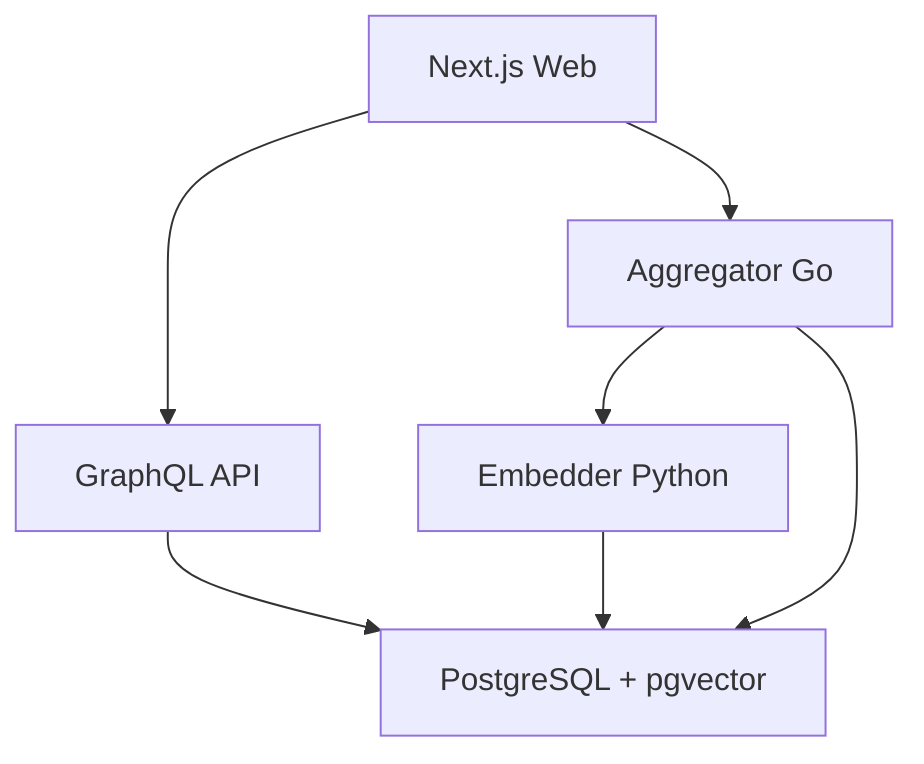

# Remote Job Radar - AI Agent Instructions

## Quick Reference

This document provides comprehensive guidelines for AI agents working on the Remote Job Radar project. For GitHub Copilot users, see also `.github/copilot-instructions.md`.

## Project Overview

Remote Job Radar is a **Turbo monorepo** for AI-powered job discovery, using a microservices architecture with enhanced UI/UX and semantic improvements.

### Repository Structure

```
remote-job-radar/
├── apps/
│   ├── web/          # Next.js 15 frontend (App Router, TanStack Query, Clerk auth, shadcn/ui)
│   └── api/          # GraphQL API (Apollo Server, Prisma, PostgreSQL)
├── services/
│   ├── aggregator/   # Go service for job fetching, deduplication, and fit scoring
│   └── embedder/     # Python FastAPI for ML embeddings (SentenceTransformers)
├── infra/            # Docker Compose for PostgreSQL + pgvector
└── .github/          # Templates, workflows, and project automation
```

## 🎯 Issue Templates & Workflow

### Available Issue Templates

The project uses **7 structured issue templates** in `.github/ISSUE_TEMPLATE/`:

#### 1. 🐛 Bug Report (`bug_report.yml`)
- **Title Format**: `[BUG] <short summary>`
- **Auto Labels**: `bug`, `triage`
- **Required Fields**:
  - **What happened?**: Steps to reproduce + expected vs actual
  - **Pre-flight checks**: Search existing issues, reproduce on main
- **Optional Fields**:
  - **Affected version/commit**: Version or commit SHA
  - **Environment**: Node version, Postgres, Browser, etc.
  - **Logs/screenshots**: Error logs or visual proof

#### 2. ✨ Feature Request (`feature_request.yml`)
- **Title Format**: `[FEAT] <short summary>`
- **Auto Labels**: `enhancement`
- **Required Fields**:
  - **Problem**: User pain being solved
- **Optional Fields**:
  - **Proposed solution**: User story + acceptance criteria
  - **Out of scope**: What's explicitly not included
  - **Success metric**: Measurable outcome
  - **Impact**: High/Medium/Low dropdown

#### 3. 📝 Documentation (`documentation.yml`)
- **Title Format**: `[DOCS] <subject>`
- **Auto Labels**: `documentation`
- **Required Fields**:
  - **Context**: What needs documenting and why
- **Optional Fields**:
  - **Proposed changes**: Specific documentation updates
  - **Scope checkboxes**: README, API reference, Architecture/ADR, Contributing/Runbook

#### 4. 🧰 Chore (`chore.yml`)
- **Title Format**: `[CHORE] <subject>`
- **Auto Labels**: `chore`
- **Required Fields**:
  - **Scope**: CI pipeline, ESLint/Prettier, dependencies, etc.
  - **No behavior change**: Required checkbox
- **Optional Fields**:
  - **Details**: Additional context
  - **Requires doc update**: Optional checkbox

#### 5. 🧹 Refactor/Cleanup (`refactor_cleanup.yml`)
- **Title Format**: `[REFACTOR] <area>`
- **Auto Labels**: `refactor`
- **Required Fields**:
  - **Area/module**: Specific code area (e.g., api/graphql, prisma models)
  - **No user-facing changes**: Required safety checkbox
- **Optional Fields**:
  - **Why**: Tech debt, readability, performance reasons
  - **Plan of attack**: Steps, risks, and test plan
  - **Safety checks**: Unit tests, E2E smoke tests

#### 6. ❓ Question/Support (`question.yml`)
- **Title Format**: `[QUESTION] <topic>`
- **Auto Labels**: `question`
- **Required Fields**:
  - **Question**: Specific question with context
- **Optional Fields**:
  - **Context**: What you tried, logs, screenshots

#### 7. Issue Template Configuration (`config.yml`)
- **Disables blank issues**: Forces template usage
- **Contact links**: Directs general questions to Discussions

### 🌿 Branch Creation Workflow

#### Automatic Branch Creation
After creating any issue, comment with the `/branch` command:

```bash
# Create branch with default 'feat' type
/branch

# Create branch with specific type
/branch bug
/branch feat  
/branch chore
/branch docs
/branch refactor
```

#### Branch Naming Convention
Branches are automatically created following this pattern:
```
<type>/<issue-number>-<kebab-case-title>
```

**Examples**:
- Issue #123 "Add user login functionality" → `feat/123-add-user-login-functionality`
- Issue #45 "Fix pagination bug" → `bug/45-fix-pagination-bug`
- Issue #78 "Update README docs" → `docs/78-update-readme-docs`

#### Branch Creation Process
1. **Auto-detects issue number** from the comment context
2. **Slugifies the issue title** (lowercase, kebab-case, max 50 chars)
3. **Creates ref** based off the default branch (main)
4. **Comments back** with checkout instructions:
   ```bash
   git fetch origin feat/123-add-user-login
   git switch -c feat/123-add-user-login --track origin/feat/123-add-user-login
   ```

#### Branch Naming Validation
All PRs are validated against the branch naming convention:
- **Pattern**: `^(feat|bug|chore|docs|refactor)/[0-9]+-[a-z0-9._-]+$`
- **Protected branches**: `main`, `next`, `develop` are exempt
- **Enforcement**: PR will fail CI if branch name doesn't match

### 📋 Pull Request Standards

#### Enhanced PR Template Structure (`.github/pull_request_template.md`)

The project uses a **comprehensive PR template** with multiple sections for better documentation and review:

##### **1. Summary & Type Selection**
- **Brief description** of what the PR accomplishes
- **Type checkboxes**: Feature, Bug Fix, Documentation, Style, Refactor, Performance, Tests, Chore, CI/CD, Breaking Change

##### **2. Issue Linking**
- **Required**: `Closes #issue_number` for automatic issue linking
- **Optional**: Related issues for reference

##### **3. What Changed (Detailed)**
- **Added**: New features, files, or functionality
- **Changed**: Modifications to existing functionality
- **Fixed**: Bug fixes and corrections
- **Removed**: Deleted features, files, or functionality

##### **4. Context & Implementation**
- **Why These Changes**: Reasoning and problem solved
- **How It Was Implemented**: Technical approach and key decisions
- **Technical Details**: Implementation specifics
- **Database Changes**: Schema modifications checklist

##### **5. Testing & Quality Assurance**
- **Test Coverage**: Unit, integration, E2E, manual testing checkboxes
- **Test Results**: Description or screenshots
- **Manual Testing Steps**: Step-by-step verification instructions

##### **6. Visual Documentation**
- **Screenshots/Demo**: Before/after comparisons for UI changes
- **Performance Impact**: Performance implications assessment
- **Security Considerations**: Security review checklist

##### **7. Documentation & Deployment**
- **Documentation**: README, API docs, AGENTS.md update requirements
- **Deployment Requirements**: Environment variables, migrations, rollback plan

##### **8. Comprehensive Checklists**

**Pre-Submission Checklist**:
- **Code Quality**: Style guidelines, self-review, comments, error handling
- **Testing & Validation**: All tests pass, edge cases, cross-browser testing
- **Integration**: No conflicts, up-to-date branch, CI passing, conventional commits
- **Impact Assessment**: Breaking changes, compatibility, dependencies, performance

**Review Checklist (for reviewers)**:
- Code quality and standards met
- Tests comprehensive and passing
- Documentation adequate
- Security and performance acceptable
- UX/UI changes intuitive
- Ready to merge

##### **9. Title Convention Reference**
**Conventional Commit Format**:
- `feat: <description>` - New feature
- `fix: <description>` - Bug fix  
- `docs: <description>` - Documentation changes
- `style: <description>` - Code style changes
- `refactor: <description>` - Code refactoring
- `perf: <description>` - Performance improvements
- `test: <description>` - Test changes
- `build: <description>` - Build system changes
- `ci: <description>` - CI/CD changes
- `chore: <description>` - Maintenance tasks
- `revert: <description>` - Reverts a previous commit

**Examples with scopes**:
- `feat(api): add job aggregation endpoint`
- `fix(web): resolve pagination crash on mobile`
- `docs: update deployment instructions`

#### PR Title Validation
- **Semantic PR Action**: Validates PR titles against Conventional Commits
- **Allowed types**: feat, fix, perf, docs, refactor, test, build, ci, chore, release
- **Subject pattern**: Must start lowercase and be descriptive
- **Error example**: "Start the subject lowercase and be descriptive, e.g. 'feat: add job aggregator API endpoint'"

### 🏷️ Labels System

The project uses a comprehensive labeling system (`.github/labels.yml`):

| Label | Color | Description | Auto-Applied By |
|-------|-------|-------------|------------------|
| `bug` |  | Something is not working | Bug report template |
| `enhancement` |  | New feature or request | Feature request template |
| `documentation` |  | Documentation improvements | Documentation template |
| `refactor` |  | Internal code change, no behavior change | Refactor template |
| `chore` |  | Tooling, CI/CD, dependencies, configs | Chore template |
| `question` |  | Further information is requested | Question template |
| `good first issue` |  | Good for newcomers | Manual |
| `help wanted` |  | Extra attention is needed | Manual |
| `triage` | Auto-applied | Needs initial review | Bug report template |

**Label Sync**: Labels are automatically synchronized when `.github/labels.yml` changes via the Labels workflow.

### 🔄 CODEOWNERS System

The project uses a CODEOWNERS file (`.github/CODEOWNERS`) for automatic PR review assignments:

```
/apps/web/          @SanchitB23
/apps/api/          @SanchitB23  
/services/aggregator/ @SanchitB23
/services/embedder/ @SanchitB23
```

**Automatic behavior**: PRs touching these paths will automatically request review from the specified owners.

## 🤖 GitHub Actions Workflows

The project includes **7 automated workflows** for comprehensive CI/CD:

### 1. 🌿 Branch Creation (`create-branch-from-issue.yml`)
**Triggers**: Issue comments containing `/branch`, Manual workflow dispatch

**Process**:
1. **Comment Detection**: Listens for `/branch` comments on issues
2. **Type Parsing**: Extracts branch type from comment (defaults to `feat`)
3. **Branch Generation**: Creates branch with pattern `<type>/<number>-<slug>`
4. **Slug Creation**: Issue title → lowercase → kebab-case → max 50 chars
5. **Base Branch**: Always branches off the default branch (main)
6. **Response**: Comments back with git checkout instructions

**Manual Usage**:
```yaml
workflow_dispatch:
  inputs:
    issue_number: "123"
    type: "feat"  # feat|bug|chore|docs|refactor
```

**Error Handling**: If branch already exists, responds with existing branch checkout instructions.

### 2. 🔍 Branch Naming Validation (`branch-naming.yml`)
**Triggers**: PR opened, synchronized, reopened, edited

**Validation Rules**:
- **Pattern**: `^(feat|bug|chore|docs|refactor)/[0-9]+-[a-z0-9._-]+$`
- **Examples**: ✅ `feat/123-add-login`, ❌ `feature/add-login`, ❌ `123-fix`
- **Protected Branch Exemption**: `main`, `next`, `develop` skip validation
- **Failure Result**: PR CI fails with clear error message and expected pattern

### 3. 🎯 Semantic PR Validation (`semantic-pr.yml`)
**Triggers**: PR target events (opened, edited, synchronized, reopened, ready_for_review)

**Validation Rules**:
- **Types**: feat, fix, perf, docs, refactor, test, build, ci, chore, release
- **Subject Pattern**: `^[a-z].+` (must start lowercase)
- **Ignore Labels**: `dependencies` (auto-generated PRs)
- **Error Message**: "Start the subject lowercase and be descriptive"
- **Token**: Uses `SEMREL_PAT` for validation

### 4. 🏗️ Continuous Integration (`ci.yml`)
**Triggers**: PRs, pushes to main/next/develop

**Multi-Service Testing**:

#### **JavaScript/TypeScript** (Apps: web, api)
- **Node.js 20** with npm caching
- **Matrix Strategy**: Tests both `apps/web` and `apps/api`
- **Steps**: Type checking, linting, format checking, building
- **Environment**: Sets dummy DATABASE_URL for API type generation
- **Clerk Auth**: Uses `NEXT_PUBLIC_CLERK_PUBLISHABLE_KEY` secret

#### **Go** (Aggregator Service)
- **Go 1.22** with golangci-lint
- **Working Directory**: `services/aggregator`
- **Steps**: Linting, vetting, race-condition testing
- **Command**: `go test ./... -race -count=1`

#### **Python** (Embedder Service)  
- **Python 3.11** with requirements installation
- **Working Directory**: `services/embedder` 
- **Steps**: Ruff linting, MyPy type checking
- **Resilient**: `pip install` allowed to fail (optional dependencies)

### 5. 🏷️ Label Synchronization (`labels.yml`)
**Triggers**: Push to develop branch (when labels change), Manual dispatch

**Process**:
1. **File Monitoring**: Watches `.github/labels.yml` and workflow file
2. **Sync Action**: Uses `crazy-max/ghaction-github-labeler@v5`
3. **Permissions**: Requires `contents: read`, `issues: write`
4. **Behavior**: `skip-delete: false` (removes labels not in config)

### 6. 🚀 Release Management (`release.yml`)
**Purpose**: Automated semantic versioning and changelog generation
**Details**: Implementation depends on semantic-release configuration

### 7. 🌐 Neon Database Previews (`neondb-preview.yml`)
**Purpose**: Creates preview database branches for PR testing
**Integration**: Connects with Neon's database branching for isolated testing

### Workflow Dependencies & Interactions



## Architecture & Data Flow

### Service Integration



**End-to-end flow:**

1. **Aggregator** fetches jobs from sources (Remotive, Adzuna) with configurable pagination
2. **Embedder** generates vector embeddings for jobs and user skills via `/embed` endpoint
3. **Aggregator** scores jobs using vector similarity (pgvector)
4. **API** exposes jobs, bookmarks, and pipeline via GraphQL with subscriptions
5. **Web** app consumes GraphQL and REST endpoints using TanStack Query

### Key Integration Patterns

- **Go ↔ Python**: HTTP calls for vectorization with retry logic
- **Go ↔ Postgres**: Direct SQL (not Prisma) for job upserts and scoring
- **API ↔ DB**: Prisma ORM, schema in `apps/api/prisma/schema.prisma`
- **Web ↔ API**: GraphQL for complex queries, Next.js API routes for simple REST
- **Web ↔ Aggregator**: Health checks and manual fetch endpoints

## Development Guidelines

### Environment Setup

1. **Start all services**: `npm run dev:all`
2. **Infra only**: `npm run dev:infra`
3. **Health check**: `npm run dev:smokeTest`
4. **Environment files**: Copy `.env.example` to `.env.local` in each app/service

### Code Standards

## 📝 Commit Message Standards

### Conventional Commits Enforcement

The project **strictly enforces** [Conventional Commits](https://www.conventionalcommits.org/) via commitlint:

#### **Format Structure**
```
<type>[optional scope]: <description>

[optional body]

[optional footer(s)]
```

#### **Allowed Types**
| Type | Purpose | Example |
|------|---------|----------|
| `feat` | New feature | `feat(api): add job aggregation endpoint` |
| `fix` | Bug fix | `fix(web): resolve pagination crash on mobile` |
| `docs` | Documentation only | `docs: update API deployment guide` |
| `style` | Code style changes | `style(web): fix ESLint warnings in components` |
| `refactor` | Code change, no behavior change | `refactor(aggregator): extract job scoring logic` |
| `perf` | Performance improvement | `perf(db): optimize vector similarity queries` |
| `test` | Adding/updating tests | `test(api): add integration tests for GraphQL` |
| `chore` | Maintenance, tooling, deps | `chore(deps): update Next.js to v15.4.5` |
| `build` | Build system changes | `build: update Dockerfile for production` |
| `ci` | CI configuration changes | `ci: add Neon database preview workflow` |
| `revert` | Revert previous commit | `revert: "feat(api): add job aggregation"` |

#### **Optional Scopes**
| Scope | Usage | Example |
|-------|-------|----------|
| `api` | GraphQL API changes | `feat(api): add bookmark mutations` |
| `web` | Frontend/web app changes | `fix(web): resolve hydration error in SSR` |
| `aggregator` | Go aggregator service | `perf(aggregator): optimize concurrent fetching` |
| `embedder` | Python embedder service | `fix(embedder): handle empty text gracefully` |
| `pipeline` | Kanban/pipeline features | `feat(pipeline): add drag-and-drop support` |
| `ui` | UI/UX improvements | `style(ui): update button hover animations` |
| `db` | Database schema/queries | `feat(db): add vector similarity index` |
| *(none)* | Cross-cutting changes | `docs: update project README` |

#### **Validation Rules (Commitlint)**

**Header (Title)**:
- **Maximum length**: 90 characters (enforced)
- **Format**: Must match `<type>[optional scope]: <description>`
- **Description**: Imperative mood, lowercase start
- **Breaking changes**: Use `!` after type/scope (e.g., `feat(api)!: remove legacy endpoints`)

**Body** (Optional):
- **Blank line required** after header
- **Line length**: Maximum 90 characters per line
- **Purpose**: Additional context, motivation, or explanation

**Footer** (Optional):
- **Blank line required** after body
- **Line length**: Maximum 100 characters per line
- **Usage**: Breaking changes, issue references
- **Breaking changes**: Start with `BREAKING CHANGE:`
- **Issue refs**: `Closes #123`, `Fixes #456`, `Refs #789`

#### **Examples**

**Simple commit**:
```
feat(pipeline): add drag-and-drop functionality to kanban board
```

**With body**:
```
fix(api): resolve job fetching pagination issue

The GraphQL resolver was incorrectly calculating offset for 
large page numbers, causing duplicate results in job listings.
```

**Breaking change**:
```
feat(api)!: migrate to GraphQL subscriptions

Replace REST endpoints with GraphQL subscriptions for real-time 
job updates and pipeline changes.

BREAKING CHANGE: REST endpoints /api/jobs and /api/pipeline 
are no longer available. Use GraphQL subscriptions instead.

Closes #234
```

**Commit with scope and references**:
```
chore(deps): update Next.js to v15.4.5

Updates include performance improvements and bug fixes.
All tests pass with the new version.

Fixes #123
Refs #456
```

#### **Common Mistakes & Fixes**

❌ **Wrong**: `Fix bug in job fetching`  
✅ **Correct**: `fix(api): resolve job fetching pagination issue`

❌ **Wrong**: `feat: Add new feature for users`  
✅ **Correct**: `feat(web): add user profile customization`

❌ **Wrong**: `Updated documentation`  
✅ **Correct**: `docs: update API deployment instructions`

❌ **Wrong**: `feat(api): This commit adds a new GraphQL endpoint for job aggregation that allows users to fetch jobs`  
✅ **Correct**: `feat(api): add job aggregation GraphQL endpoint`

#### Imports & Code Organization

- **Web app**: Use `@/` alias for `apps/web/` paths
- **Import sorting**: Use simple-import-sort (automatic)
- **Types**: Centralized in `apps/web/types/gql.d.ts`
- **Return types**: Explicit return types required

#### Console Logging Pattern

Use consistent logging format:

```javascript
console.log("[Filename] [functionName] varName:", value);
```

Example:
```javascript
console.log("[JobCard.tsx] [handleBookmark] jobId:", jobId);
console.trace("[JobCard.tsx] [handleBookmark] error:", error);
```

### UI/UX Guidelines

#### Component System

- **Framework**: shadcn/ui with Tailwind CSS
- **Icons**: Heroicons for consistency
- **Themes**: Dark/light mode support with next-themes
- **Animations**: Smooth transitions and micro-interactions

#### State Management

- **Server State**: TanStack Query for all data fetching/mutations
- **UI State**: React state for local component state
- **Optimistic Updates**: Use for bookmarks and pipeline operations
- **Error Handling**: Always include error boundaries and fallback states

#### Responsive Design

- **Mobile-first**: Design for mobile, enhance for desktop
- **Grid Layouts**: Adaptive layouts for job listings and kanban boards
- **Loading States**: Skeleton loaders and loading indicators
- **Error States**: User-friendly error messages with retry actions

### Database Patterns

- **Schema**: Defined in `apps/api/prisma/schema.prisma`
- **Key tables**: `jobs` (with vector), `bookmarks`, `PipelineItem`
- **Vector search**: Uses `pgvector` for semantic job matching
- **Migrations**: `npx prisma migrate dev` (run in `apps/api`)

## Common Tasks & Patterns

### Adding New Job Source (Go)

1. Implement fetcher in `services/aggregator/internal/fetch/`
2. Register in `cmd/serve/main.go`
3. Map fields to DB schema
4. Add configuration in environment files

### Extending GraphQL Schema

1. Edit `apps/api/src/schema.graphql` and `resolvers/`
2. Update Prisma schema if DB changes needed
3. Run `npx prisma migrate dev` and regenerate client

### Adding New UI Feature

1. Create component in `apps/web/components/` using shadcn/ui patterns
2. Use TanStack Query hooks for data with proper error handling
3. Add API route or GraphQL resolver as needed
4. Include loading states and error boundaries

### Pipeline/Kanban Functionality

1. Update `PipelineItem` schema if needed
2. Modify kanban board components with drag-and-drop (@dnd-kit)
3. Ensure optimistic updates work correctly
4. Test error states and recovery scenarios

## Testing & Debugging

### Quick Tests

```bash
# API GraphQL test
curl -X POST http://localhost:4000/graphql \
  -H 'Content-Type: application/json' \
  -d '{"query":"{ jobs(first:3){ id title fitScore } }"}'

# Aggregator health
curl http://localhost:8080/health

# Manual fetch
curl -X POST http://localhost:8080/api/fetch?source=remotive

# Check database
docker exec -it remote-job-radar-db-1 psql -U postgres \
  -c "SELECT COUNT(*) FROM jobs;"

# Prisma Studio
npx prisma studio  # (in apps/api)
```

### Debugging Tools

- **Service Status**: Visit `/status` page for real-time health monitoring
- **Pipeline Testing**: Test drag-and-drop on `/kanban` page
- **UI State**: React DevTools and TanStack Query DevTools
- **Database**: Monitor slow queries and vector search performance

## Important Considerations

### Server Management

**⚠️ Servers are usually already running during development.**

- **Do NOT** prompt to start servers unless explicitly requested
- **Avoid** cancelling or interrupting running server processes
- This prevents disrupting development flow and prompt interruptions

### Authentication

- **Clerk JWT**: All API calls require Clerk JWT context
- Use `getToken({ template: "remote-job-radar" })` for API calls

### Configuration

- **Skills**: Edit `services/aggregator/skills.yml` for meaningful fit scores
- **Embeddings**: Jobs must be embedded before fit scoring works
- **Turbo**: Use `turbo dev` for monorepo caching

### Performance

- **Debounced inputs**: Search and filters use 300ms debounce
- **Infinite scroll**: `useInfiniteJobs` hook for paginated job lists
- **Optimistic updates**: Instant feedback for user actions
- **Caching**: TanStack Query handles all client-side caching

## Error Handling Best Practices

1. **Always include error boundaries** in React components
2. **Provide fallback UIs** for failed states
3. **Use retry mechanisms** for network calls
4. **Show user-friendly error messages** with actionable steps
5. **Log errors properly** with context and stack traces

## 🎨 Workflow Best Practices

### Complete Development Flow

1. **🎯 Create Issue** using appropriate template
2. **🌿 Generate Branch** with `/branch [type]` comment
3. **⏳ Wait for Branch Creation** (automated response with checkout instructions)
4. **🔄 Checkout New Branch** using provided git commands
5. **📋 Create Draft PR** to develop branch immediately
6. **🛠️ Implement Changes** following code standards
7. **📝 Commit & Push** with conventional commit messages
8. **✅ Mark PR Ready** when implementation is complete
9. **🔍 Wait for CI Validation** - ensure all checks pass before requesting review
10. **💬 Request User Review** explicitly in PR comments only after CI passes
11. **🔎 Code Review** (automatic CODEOWNERS assignment)
12. **⏳ Wait for User Approval** - agents must NOT merge
13. **🔀 User Merges** to develop (then eventually to main)

### ⚠️ Critical Workflow Rules

**🚫 Never Skip Templates**
- Always use issue templates - blank issues are disabled
- Always fill required fields - validation will fail otherwise
- Always follow title formats - automation depends on them

**🎯 Branch Naming is Enforced**
- Use `/branch` command - don't create branches manually
- Pattern `<type>/<number>-<slug>` is strictly enforced
- PR will fail CI if branch name doesn't match

**📝 Commit Messages are Validated**  
- commitlint runs on every commit
- Maximum 90 characters for header
- Use conventional commit format exactly
- Breaking changes must use `!` notation

**🚀 PR Requirements**
- Title must be semantic (validated by GitHub Action)
- Must link to issue: `Closes #123`
- All CI checks must pass
- CODEOWNERS review required

### 🤖 **MANDATORY: Agent Issue Pickup Workflow**

**⚠️ When an agent picks up ANY existing issue, you MUST follow this exact sequence:**

#### Step 1: Comment `/branch` on the Issue
```markdown
/branch
```

**Or specify the type explicitly:**
```markdown
/branch bug    # For bug fixes
/branch feat   # For new features  
/branch docs   # For documentation
/branch chore  # For maintenance
/branch refactor # For code refactoring
```

#### Step 2: Wait for Automated Response
The GitHub Action will automatically:
1. **Create a new branch** with the correct naming pattern
2. **Comment back** with the branch name and checkout instructions

**Example automated response:**
```markdown
Created branch `feat/123-add-user-login-functionality` off `main`.

**Checkout:**
```bash
git fetch origin feat/123-add-user-login-functionality
git switch -c feat/123-add-user-login-functionality --track origin/feat/123-add-user-login-functionality
```
```

#### Step 3: Checkout the Created Branch
**Use the EXACT git commands provided in the automated response:**

```bash
# Example (use the actual branch name from the response)
git fetch origin feat/123-add-user-login-functionality
git switch -c feat/123-add-user-login-functionality --track origin/feat/123-add-user-login-functionality
```

#### Step 4: Verify You're on the Correct Branch
```bash
git branch --show-current
# Should show: feat/123-add-user-login-functionality
```

#### Step 5: Create Draft Pull Request
**After checking out the branch, immediately create a draft PR:**

```bash
# Option 1: Using GitHub CLI (if available)
gh pr create --draft --base develop --title "[WIP] feat: add user login functionality" --body "Fixes #123\n\n- [ ] Implementation in progress\n- [ ] Tests pending\n- [ ] Documentation pending"

# Option 2: Create via GitHub web interface
# Go to: https://github.com/SanchitB23/remote-job-radar/compare/develop...your-branch-name
# Select "Create draft pull request"
```

**Draft PR Requirements:**
- **Base branch**: `develop` (default integration branch)
- **Title**: Follow conventional commit format with `[WIP]` prefix
- **Body**: Link to issue with `Fixes #123` and checklist of pending work
- **Draft status**: Must be marked as draft initially

#### Step 6: Start Implementation
**Only AFTER creating the draft PR:**
- Read the issue requirements carefully
- Plan your implementation approach
- Make the necessary code changes
- Follow the commit message standards
- Test your changes
- Push commits to update the draft PR

### 🚒 **CRITICAL: Never Skip the `/branch` Step**

**❌ DO NOT:**
- Create branches manually
- Start work without commenting `/branch`
- Use non-standard branch names
- Work directly on main/develop branches
- Assume a branch already exists

**✅ ALWAYS:**
- Comment `/branch` first
- Wait for the automated response
- Use the exact checkout commands provided
- Verify you're on the correct branch before starting
- Follow the complete workflow sequence

### 🤖 **Agent Tool Usage Guidelines**

#### GitHub MCP Integration
**Agents can and should use GitHub MCP tools for GitHub-related tasks:**

**✅ Use GitHub MCP for:**
- Creating issues with proper templates
- Commenting `/branch` on issues
- Creating draft pull requests
- Adding comments to PRs and issues
- Checking issue/PR status and details
- Managing labels and assignments
- Reviewing PR files and changes

**GitHub MCP Commands Examples:**
```bash
# Create issue with template
call_mcp_tool create_issue

# Add /branch comment
call_mcp_tool add_issue_comment

# Create draft PR
call_mcp_tool create_pull_request --draft

# Get PR details
call_mcp_tool get_pull_request
```

### ⛔ **CRITICAL: PR/MR Merge Restrictions**

**🚨 AGENTS MUST NEVER MERGE PRs/MRs**

**❌ ABSOLUTELY FORBIDDEN:**
- Merging pull requests (even your own)
- Approving pull requests without user review
- Using merge tools or commands
- Bypassing review requirements
- Auto-merging any changes

**✅ REQUIRED PROCESS:**
1. **Create and complete** your implementation
2. **Mark PR as ready** for review (remove draft status)
3. **Request user review** explicitly
4. **Wait for user approval** before any merge
5. **Let the user merge** after they review and approve

**Why this is critical:**
- 👥 **Human oversight**: All code changes need human review
- 🔒 **Quality control**: Users validate implementation meets requirements
- 🛡️ **Risk prevention**: Prevents automated merging of potentially problematic code
- 📊 **Project integrity**: Maintains code quality and project standards

### 📋 **Draft PR Creation Process**

**After checking out your branch, IMMEDIATELY create a draft PR:**

#### Using GitHub CLI (Recommended)
```bash
gh pr create --draft --base develop --title "[WIP] feat: add user login functionality" --body "Fixes #123\n\n## Implementation Progress\n- [ ] Core functionality\n- [ ] Tests added\n- [ ] Documentation updated\n- [ ] Ready for review"
```

#### Using GitHub Web Interface
1. **Navigate to**: `https://github.com/SanchitB23/remote-job-radar/compare/develop...your-branch-name`
2. **Click**: "Create pull request"
3. **Select**: "Create draft pull request" (dropdown arrow next to the button)
4. **Set base**: `develop` branch
5. **Title format**: `[WIP] <type>: <description>`
6. **Body requirements**:
   ```markdown
   Fixes #123
   
   ## Implementation Progress
   - [ ] Core functionality
   - [ ] Tests added  
   - [ ] Documentation updated
   - [ ] Ready for review
   ```

#### Draft PR Benefits
- 👁️ **Early visibility**: Team can see work in progress
- 💬 **Early feedback**: Get input before implementation is complete
- 🔄 **CI integration**: Tests run on every push
- 📊 **Progress tracking**: Clear checklist of remaining work
- 🔗 **Issue linkage**: Automatic connection to the original issue

#### Converting from Draft to Ready
**When your implementation is complete:**
1. **Update the PR body** - check off completed items
2. **Remove `[WIP]` from title**
3. **Click "Ready for review"** button
4. **Add reviewers** (if not auto-assigned via CODEOWNERS)

**Why this matters:**
- 🎯 **Enforced naming**: Automation ensures correct branch patterns
- 🔄 **Workflow integration**: All subsequent automation depends on proper branch names
- 🛡️ **Conflict prevention**: Avoids naming collisions and workflow failures
- 📊 **Tracking**: Links branches directly to issues for better project management
- 📋 **Early integration**: Draft PRs to develop enable continuous integration testing

### 🔧 Automation Integration

The project is **heavily automated**. Work **with** the automation, not against it:

**✅ Good Practices**:
- **ALWAYS comment `/branch` first** when picking up any issue
- **Wait for automated branch creation** before starting work
- **Use exact checkout commands** provided by the automation
- **Create draft PR to develop immediately** after checkout
- **Update draft PR regularly** as you implement changes
- **Use GitHub MCP tools** for all GitHub-related tasks
- **🚨 ENSURE ALL CI CHECKS PASS** before requesting review
- **Monitor CI pipeline status** and fix failures immediately
- **Test formatting/linting locally** before pushing
- **Request user review explicitly** only after CI is green
- **Wait for user approval** before any merge consideration
- Follow naming conventions exactly (enforced automatically)
- Use conventional commits consistently
- Fill out PR templates completely
- Reference issues in commits and PRs
- **Convert draft to ready** only when implementation is complete AND CI passes

**❌ Bad Practices**:
- Starting work without commenting `/branch` first
- Creating branches manually with non-standard names
- Ignoring automated responses and checkout instructions
- **🚨 Requesting review while CI checks are failing**
- **🚨 Ignoring or dismissing CI failures without fixing them**
- **🚨 Pushing code without local format/lint validation**
- **Merging PRs without user review and approval**
- **Using merge commands or tools as an agent**
- **Auto-approving or bypassing review requirements**
- Skipping issue templates or required fields
- Using non-conventional commit messages
- Creating PRs without linking issues
- Ignoring CI failures or validation errors

### ⚠️ **MANDATORY: CI Validation Before Review**

**🚨 CRITICAL WORKFLOW RULE: Never request review until ALL CI checks pass!**

#### CI Check Requirements
**Before marking PR ready for review, you MUST ensure:**

1. **✅ All CI jobs pass** - No red X marks on the PR
2. **✅ Format checks pass** - Prettier/ESLint for JS/TS, Ruff for Python
3. **✅ Type checking passes** - TypeScript compiler, MyPy for Python
4. **✅ Linting passes** - ESLint for JS/TS, golangci-lint for Go, Ruff for Python
5. **✅ Build succeeds** - All applications build without errors
6. **✅ Tests pass** - Unit tests and integration tests run successfully

#### CI Failure Response Process
**If ANY CI check fails:**

1. **🔍 Examine the CI logs** to identify the specific failure
2. **🔧 Fix the issues locally** (formatting, linting, type errors, etc.)
3. **🧪 Test fixes locally** before pushing:
   ```bash
   # For formatting issues
   npm run format --workspace apps/web
   npm run format --workspace apps/api
   
   # For linting issues  
   npm run lint --workspace apps/web
   npm run lint --workspace apps/api
   
   # For type checking
   npm run typecheck --workspace apps/web
   npm run typecheck --workspace apps/api
   
   # For Go issues
   cd services/aggregator && golangci-lint run
   cd services/aggregator && go vet ./...
   
   # For Python issues
   cd services/embedder && ruff check .
   cd services/embedder && mypy .
   ```
4. **📝 Commit fixes** with conventional commit messages
5. **🚀 Push changes** and wait for CI to re-run
6. **🔁 Repeat until all checks pass**

#### Common CI Failures and Fixes

**❌ Prettier/Formatting Failures:**
- **Cause**: Code not formatted according to project standards
- **Fix**: Run `npm run format` in affected workspace
- **Prevention**: Set up IDE auto-formatting on save

**❌ ESLint/Linting Failures:**
- **Cause**: Code style violations or potential issues
- **Fix**: Run `npm run lint` and address reported issues
- **Auto-fix**: Many issues can be fixed with `npm run lint -- --fix`

**❌ TypeScript Compilation Failures:**
- **Cause**: Type errors, missing types, or incorrect imports
- **Fix**: Run `npm run typecheck` and resolve type issues
- **Common**: Import paths, missing return types, incorrect prop types

**❌ Go Linting Failures:**
- **Cause**: Go code style violations or potential bugs
- **Fix**: Run `golangci-lint run` in `services/aggregator/`
- **Common**: Unused variables, inefficient code, formatting

**❌ Python Linting Failures:**
- **Cause**: Python code style violations
- **Fix**: Run `ruff check .` and `mypy .` in `services/embedder/`
- **Common**: Import sorting, unused imports, type annotations

#### Why CI Validation is Mandatory

**🎯 Quality Assurance:**
- Ensures consistent code quality across the entire codebase
- Prevents introduction of formatting inconsistencies
- Catches type errors and potential bugs early

**⚡ Review Efficiency:**
- Reviewers can focus on logic and implementation rather than style
- Reduces back-and-forth on formatting and linting issues
- Speeds up the overall review and merge process

**🔧 Continuous Integration:**
- Maintains the integrity of the CI pipeline
- Prevents CI failures from accumulating
- Ensures the main/develop branches stay stable

**📋 Professional Standards:**
- Demonstrates attention to detail and code quality
- Maintains professional development practices
- Sets a good example for collaborative development

### 🛠️ Developer Tools Integration

**commitlint**: Enforces commit message format
- Runs on every commit
- Fails build if format is wrong
- Configured in `commitlint.config.cjs`

**ESLint + Prettier**: Code quality and formatting
- Runs in CI for all TypeScript/JavaScript
- Must pass for PR to be mergeable
- Auto-fixes available in most IDEs

**golangci-lint**: Go code quality
- Comprehensive linting for aggregator service
- Includes race condition detection
- Must pass for PR to be mergeable

**Ruff + MyPy**: Python code quality
- Modern Python linting and type checking
- Runs on embedder service
- Resilient to missing optional dependencies

## 📚 Reference Documentation

### Project Documentation
- **🏠 Main README**: `/README.md` - Complete setup and overview
- **🌐 Web App README**: `/apps/web/README.md` - Frontend specifics
- **🚀 Environment Setup**: `/ENVIRONMENT_SETUP.md` - Detailed setup guide
- **🤖 Copilot Instructions**: `/.github/copilot-instructions.md` - GitHub Copilot specific
- **📝 Git Commit Guide**: `/.github/git-commit-instructions.md` - Commit message help

### Template References
- **Issue Templates**: `.github/ISSUE_TEMPLATE/` - All 6 structured templates
- **PR Template**: `.github/pull_request_template.md` - Pull request format
- **Workflow Files**: `.github/workflows/` - All automation definitions
- **Labels Config**: `.github/labels.yml` - Label definitions and colors
- **CODEOWNERS**: `.github/CODEOWNERS` - Automatic review assignments

### External Resources
- **[Conventional Commits](https://www.conventionalcommits.org/)** - Commit message standard
- **[Semantic Versioning](https://semver.org/)** - Version numbering scheme
- **[GitHub Flow](https://docs.github.com/en/get-started/quickstart/github-flow)** - Branch and PR workflow

## ❓ Need Help?

### For Questions
1. **Check existing documentation** first (this guide, READMEs)
2. **Search existing issues** for similar questions
3. **Create a question issue** using the `question.yml` template
4. **Use GitHub Discussions** for general project discussion

### For Bugs
1. **Reproduce the issue** on the latest main branch
2. **Search existing bugs** to avoid duplicates
3. **Use bug report template** with all required information
4. **Include logs/screenshots** for faster resolution

### For Feature Requests
1. **Check if feature exists** in current codebase
2. **Search existing features** to avoid duplicates  
3. **Use feature request template** with user story format
4. **Include success metrics** for measuring impact

---

🎨 **Remember**: This project values **consistency**, **automation**, and **clear communication**. Following these guidelines ensures smooth collaboration and maintains code quality across all contributions.
